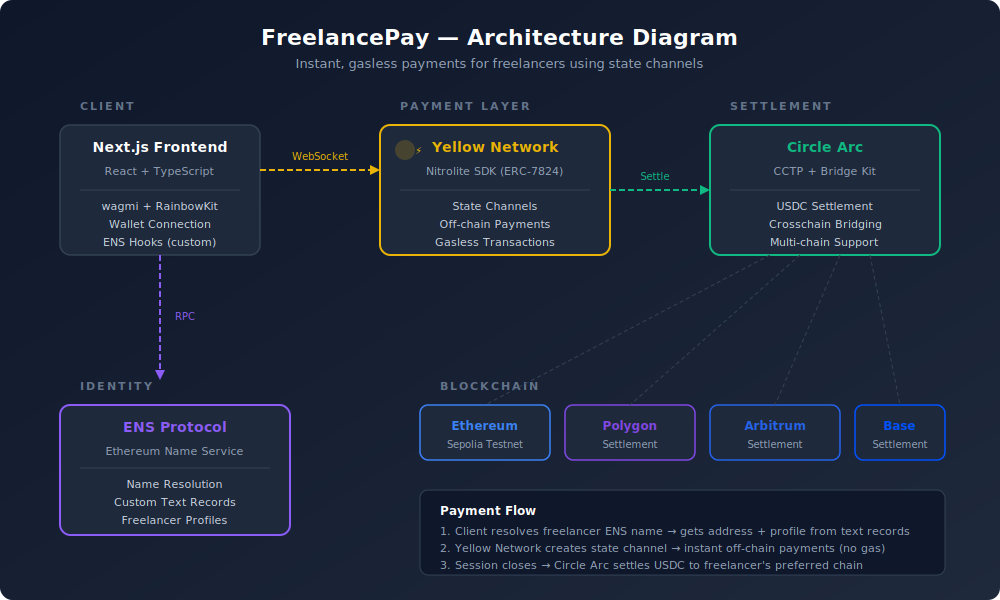

# ⚡ FreelancePay

**Instant, gasless payments for freelancers using state channels.**

Built for [HackMoney 2026](https://ethglobal.com/events/hackmoney2026) by [@robertointech](https://github.com/robertointech)

---

## 🎯 Problem

Freelancers face a broken payment experience:

- **High fees**: Payment processors charge 3–8% per transaction
- **Slow settlements**: Payments take 3–7 days to arrive
- **Multiple transactions**: Each milestone payment costs gas
- **No portable identity**: Profiles are locked to centralized platforms

## 💡 Solution

FreelancePay enables **instant, gasless payments** between clients and freelancers using **Yellow Network state channels**. Freelancers create portable profiles on **ENS** and receive **USDC** settled via **Circle Arc** on their preferred chain.

### How It Works

1. **Freelancer registers** an ENS name and stores their rate, services, and preferred chain as ENS text records
2. **Client searches** the freelancer's ENS name (e.g., `robertofreelance.eth`)
3. **Client opens a payment session** — deposits USDC into a Yellow Network state channel
4. **Instant payments** — multiple payments are sent off-chain with zero gas fees
5. **Session closes** — final balance is settled on-chain via Circle Arc CCTP

> Only 2 on-chain transactions (deposit + settlement) instead of 1 per payment.

---

## 🏗️ Architecture



| Layer | Technology | Purpose |
|-------|-----------|---------|
| **Identity** | ENS Protocol | Name resolution, freelancer profiles via text records |
| **Payments** | Yellow Network (Nitrolite SDK) | State channels for instant, gasless off-chain payments |
| **Settlement** | Circle Arc (CCTP) | Crosschain USDC settlement to freelancer's preferred chain |
| **Frontend** | Next.js 14 + TypeScript | React-based UI with wallet integration |
| **Wallet** | RainbowKit + wagmi | Multi-wallet support with Sepolia testnet |

### Payment Flow

```
Client → [Deposit USDC] → Yellow State Channel → [Instant Payments ⚡] → Close → [Circle Arc Settlement] → Freelancer
```

---

## 🛠️ Tech Stack

- **Framework**: Next.js 14, React, TypeScript
- **Styling**: Tailwind CSS
- **Wallet**: RainbowKit + wagmi v2
- **State Channels**: `@erc7824/nitrolite` (Yellow Network SDK)
- **Identity**: ENS (custom hooks, not just RainbowKit defaults)
- **Settlement**: Circle Arc CCTP (crosschain USDC bridging)
- **Network**: Ethereum Sepolia Testnet

---

## ✨ Features

- 🔍 **ENS Name Search** — Look up any freelancer by their `.eth` name
- 👤 **On-chain Profiles** — Rates, services, bio, and preferred chain stored as ENS text records
- ⚡ **Instant Payments** — Off-chain state channel payments via Yellow Network (<100ms)
- 💸 **Zero Gas Fees** — Pay multiple times within a session without any gas costs
- 🌐 **Multi-chain Settlement** — Settle USDC on Ethereum, Polygon, Arbitrum, Base, or Arc
- 🔐 **Non-custodial** — Users maintain full control of their funds
- 📱 **Responsive UI** — Works on desktop and mobile

---

## 🚀 Getting Started

### Prerequisites

- Node.js 18+
- MetaMask or any WalletConnect-compatible wallet
- Sepolia testnet ETH ([faucet](https://sepoliafaucet.com))

### Installation

```bash
git clone https://github.com/robertointech/freelance-pay.git
cd freelance-pay
npm install
```

### Environment Setup

Create a `.env.local` file:

```env
NEXT_PUBLIC_WALLETCONNECT_PROJECT_ID=your_project_id
```

### Run

```bash
npm run dev
```

Open [http://localhost:3000](http://localhost:3000)

### Demo Flow

1. Visit the landing page
2. Search for `robertofreelance.eth`
3. Click "Pay Now"
4. Connect your wallet (Sepolia network)
5. Start a payment session (deposits USDC to state channel)
6. Send instant payments — zero gas!
7. Close session to settle on-chain

---

## 📁 Project Structure

```
freelance-pay/
├── src/
│   ├── app/
│   │   ├── page.tsx              # Landing page with ENS search
│   │   ├── dashboard/page.tsx    # Freelancer profile editor
│   │   └── pay/[ens]/page.tsx    # Payment flow page
│   ├── hooks/
│   │   ├── useYellowSession.ts   # Yellow Network SDK integration
│   │   └── useENSProfile.ts      # Custom ENS text record hooks
│   ├── lib/
│   │   ├── yellow.ts             # Yellow Network wrapper
│   │   ├── ens.ts                # ENS utilities
│   │   ├── circle.ts             # Circle Arc bridge
│   │   ├── wagmi.ts              # Wagmi + RainbowKit config
│   │   └── constants.ts          # App constants
│   └── types/
│       └── index.ts              # TypeScript types
├── architecture-diagram.svg
└── README.md
```

---

## 🔗 Sponsor Integration Details

### Yellow Network — State Channels (Nitrolite SDK)

- Imported `@erc7824/nitrolite` SDK (ERC-7824)
- Functions used: `createAppSessionMessage`, `createCloseAppSessionMessage`, `parseRPCResponse`
- WebSocket connection to ClearNode (`wss://clearnet.yellow.com/ws`)
- Off-chain payment state updates with wallet signatures
- Session management: create → send payments → close/settle

### ENS — Decentralized Identity

- **Custom code** — not just RainbowKit's built-in ENS support
- Custom `useENSProfile` hook for reading/writing text records
- Custom `useEnsAddress` with `chainId: sepolia.id` for Sepolia resolution
- Freelancer profiles stored as ENS text records:
  - `com.freelancepay.rate` — hourly rate
  - `com.freelancepay.services` — offered services
  - `com.freelancepay.chain` — preferred settlement chain
  - `com.freelancepay.available` — availability status
- ENS name registered: `robertofreelance.eth` (Sepolia)

### Circle Arc — Crosschain USDC Settlement

- CCTP integration for crosschain USDC bridging
- Multi-chain support: Ethereum, Polygon, Arbitrum, Base, Arc Testnet
- Settlement flow: state channel closes → USDC bridged to freelancer's preferred chain
- Bridge Kit integration for seamless crosschain transfers

---

## 🏆 Bounty Tracks

| Sponsor | Track | Prize |
|---------|-------|-------|
| Yellow Network | Best use of Yellow SDK | $5,000 |
| ENS | Best creative DeFi use | $1,500 |
| Circle | Best use of Arc + USDC | $5,000 |

---

## 📄 License

MIT

---

## 🙏 Acknowledgments

- [Yellow Network](https://yellow.org) — State channel infrastructure
- [ENS](https://ens.domains) — Decentralized naming
- [Circle](https://circle.com) — USDC and crosschain settlement
- [ETHGlobal](https://ethglobal.com) — HackMoney 2026 hackathon
